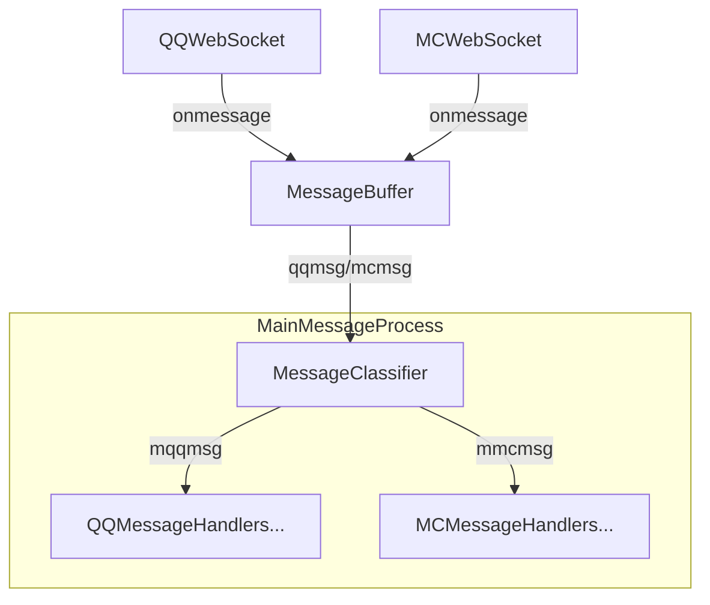

# 机器人框架

```mermaid
graph
QQWebSocket -- onmessage --> MessageBuffer
MCWebSocket -- onmessage --> MessageBuffer
MessageBuffer -- qqmsg/mcmsg --> MessageClassifier
subgraph MainMessageProcess 
    MessageClassifier -- mqqmsg --> QQMessageHandlers...
    MessageClassifier -- mmcmsg --> MCMessageHandlers...
end
```